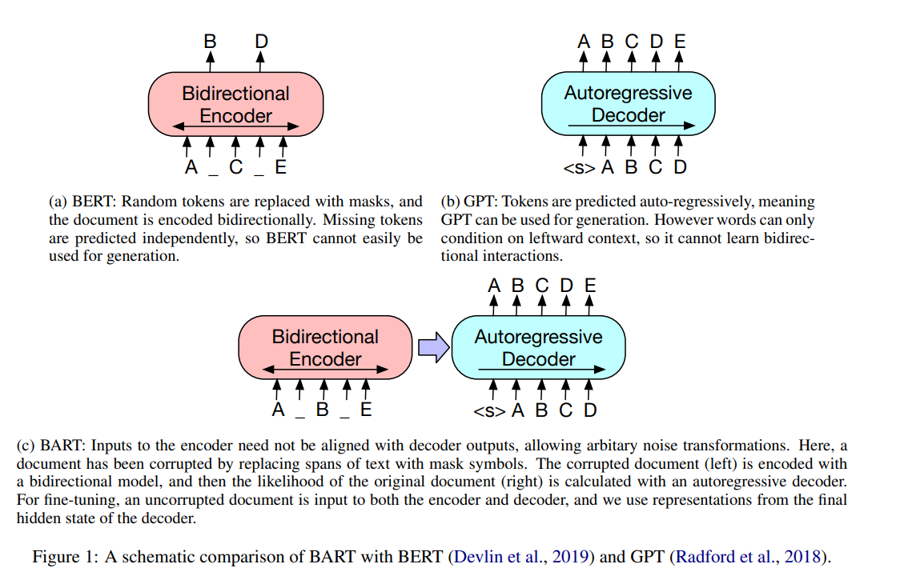
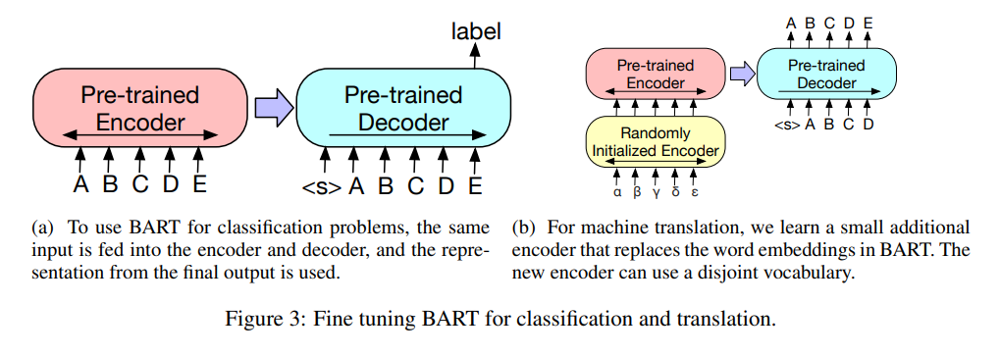
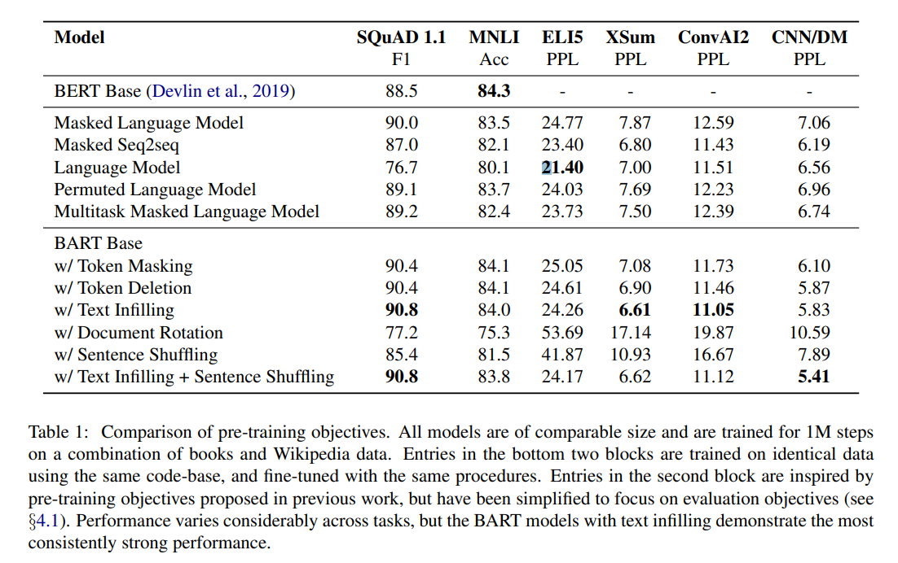
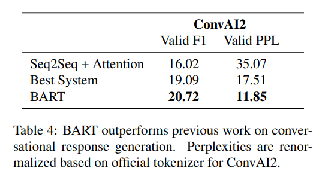
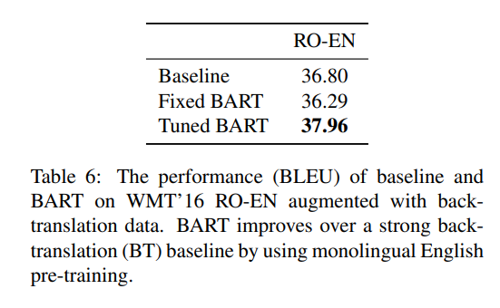

이번 시간에는 [BART: Denoising Sequence-to-Sequence Pre-training for Natural Language Generation, Translation, and Comprehension](https://arxiv.org/abs/1910.13461) 논문을 리뷰합니다.  
BART는 Facebook에서 발표한 모델로, 기존 트랜스포머 구조에 새로운 사전 학습 태스크를 제시하였습니다.
텍스트 생성과 이해에서 SOTA 성능을 보이며, 주목을 받은 모델입니다.

## Abstract & Introduction

- BART는 seq2seq 모델의 프리트레인을 위한 **denoising autoencoder**
- BART는 기초적인 Transformer 기반 neural machine translation 구조임
- BART의 학습 방법
    - **임의의 noising function으로 손상된 텍스트를 복구하도록 학습**
- 본 연구에서는 다양한 noising 기법을 평가함
    - 이때 **원본 문장을 랜덤하게 섞고, Text Infilling 기법을 사용할 때 가장 좋은 성능을 보임**
- BART는 **문장 생성과 문맥 이해 Task에 특히 효과적**
- RoBERTa와 유사한 학습 환경에서 QA, 요약, abstractive dialogue Task들에서 SOTA 성능을 보임

## Model

### Architecture

BART는 기본적인 **Seq2Seq Transformer 구조를 채택**하였습니다. 이때 R**eLU 활성화 함수 대신 GeLUs를 사용였습니다.**

**Base Model**은 인코더와 디코더가 6개의 레이어로 구성되었고, **large model**의 경우 12개의 레이어로 구성되었습니다.

### BERT와의 차이점
**BART와 BERT 모델의 주요한 차이점**을 알아보겠습니다.

- BART는 디코더의 각 레이어가 인코더의 마지막 히든 레이어에 추가적으로 **cross-attention을 수행**합니다.
- BERT는 word prediction 전에 추가적인 feed-forward network을 사용하지만, **BART는 추가적인 레이어를 사용하지 않습니다.**

BART는 동일한 사이즈의 BERT 대비 10% 많은 파라미터를 가집니다.  

### Pre-training

BART는 **손상된 문장들을 복구하는 방식으로 학습합니다.**  

  

기존 denosing atoencoder는 **특정 nosing scheme으로 한정**되어 있었습니다. **하지만 BART는 어떤 타입의 document corruption이라도 사용할 수 있습니다.**

- **Token Masking**
    - BERT처럼 랜덤한 위치의 Token을 [MASK] 토큰으로 대체합니다.
- **Token Deletion**
    - 입력에서 랜덤한 token들을 삭제한다. Token Masking와의 차이점은 모델은 삭제된 토큰의 위치가 어디인지 알아내야 한다.
- **Text Infilling**
    - 여러 개의 text span을 선택하고, 이를 하나의 [MASK] 토큰으로 대체합니다. 이때 span의 길이는 푸아송 분포를 통해 구합니다.
    - 이 기법의 경우 SpanBERT에서 아이디어를 얻었다고 합니다. 하지만 SpanBERT은 span의 길이를 알려주었지만, 해당 연구에서는 알려주지 않는다는 차이점이 있습니다. 따라서 모델은 span에서 얼마나 많은 토큰이 빠졌는지 예측하여야 합니다.
- **Sentence Permutation**
    - document를 문장 단위로 나누고, 랜덤한 순서로 섞습니다.
- **Document Rotation**
    - 랜덤으로 토큰을 하나 정합니다. 문서가 해당 토큰부터 시작하도록 문장의 순서를 회전합니다. 모델은 document의 시작점을 예측하여야 합니다.  

## Fine-tuning

BART 모델에서 각 Task에 대해 파인튜닝을 어떻게 진행했는지 살펴봅시다.  

- **Sequence Classification Tasks**
    - 인코더와 디코더에 동일한 Input을 넣습니다. **그리고 마지막 Decoder Token의 마지막 Hidden State은 multi-class linear classifier에 전달됩니다.** BERT의 CLS 토큰과 유사하게, 마지막 토큰의 representation까지 추가해 전체 input에 대한 디코더의 attention을 계산할 수 있도록 합니다.
- **Token Classification Tasks**
    - Encoder와 Decoder에 완전한 document를 전달합니다. 그리고 각 최상단 hidden state를 사용하여 분류를 수행합니다.
- **Sequence Generation Tasks**
    - BART는 autoregressive decoder를 가지고 있기 때문에 QA나 요약과 같은 Sequence Generation task에 바로 적용할 수 있습니다. 이들 Task들은 input에서 정보가 복사되지만 조작된다는 특징이 있습니다. 이는 denoising pre-training objective와 밀접한 연관이 있습니다. 따라서 encoder의 입력은 input sequence가 되고 decoder는 autoregressive하게 출력합니다.
- **Machine Translation**
    - 기계번역은 두 개의 다른 언어를 다룹니다. 따라서 인코더와 디코더 모두 같은 언어로 프리트레인된 BART 모델을 기계 번역 Task에 바로 사용할 수 없습니다.
    - 이를 해결하기 위해 다른 언어로 프리트레인된 인코더 혹은 디코더를 합치는 연구가 있었습니다. 이때 이전 연구에서 모델에 프리트레인된 인코더를 합쳐 성능을 향상될 수 있지만, 프리트레인된 디코더의 경우 성능 향상이 제한됨으로 알려져 있었습니다.
    - **연구팀은 BART 모델 전체를 기계번역 디코더로 사용하고, 여기에 bitext로 학습된 새로운 Encoder 파라미터를 추가하여 해결할 수 있음을 보였습니다.**
    - 보다 자세히 살펴보면, BART 인코더의 임베딩 레이어를 새로운 랜덤하게 초기화된 인코더로 교체합니다.
    - 모델은 end-to-end로 학습됩니다. 새로운 인코더는 외국어 단어들을 매핑하도록 학습하여, BART가 이들을 영어로 denoise할 수 있도록 합니다.
    - 이때 새로운 인코더는 기존 BART 모델과 다른 vocabulary를 사용하여도 됩니다.
    - 연구팀은 source encoder를 2가지 단계로 학습시킨다고 합니다.
    - 두가지 단계 모두 BART 모델의 출력으로부터 나온 cross-entropy loss로 역전파를 수행합니다.
    - 첫번째 단계는 대부분의 BART 파라미터는 freeze 시킵니다. 그리고 랜덤하게 초기화된 source encoder, BART positional embedding, BART 인코더의 첫번째 레이어의 self-attention input projection matrix만을 학습시킵니다.
    - 두번째 단계로 적은 수의 iteration으로 전체모델 파라미터를 학습시킵니다.  

## Comparing Pre-training Objectives

BART는 이전 연구들에 비해 더 많은 nosing scheme을 지원합니다. **연구팀은 base-size model(6 encoder and 6 decoder layers, with a hidden size of 768)을 사용하여 다양한 옵션을 비교하였습니다.**  

- **Comparison Objectives**
    - BART와 기존 모델 간의 아키텍쳐 차이, 파인 튜닝 절차, 학습 데이터와 리소스 차이로 완전히 공평한 비교는 힘듭니다.
    - **연구팀은 프리트레인 목적에 관련 없는 것들만 가능한 한 조정하여 실험을 진행하였습니다.**
    - 하지만 성능을 향상 시키기 위한 학습률이나 레이어 정규화등은 약간 변형하였다.
- **Language Model**
    - GPT와 유사하게 left-to-right Transformer Lanauge Model을 학습시켰다. 이 모델은 cross-attention이 없는 BART decoder 모델과 같다.
- **Permuted Language Model**
    - XLNet에 기반하여, 토큰들의 1/6을 샘플링하고, autoregressive하게 랜덤한 순서로 이들 토큰을 생성하였다.
    - 다른 모델과의 일관성을 위해 XLNet의 relative positional embedding이나 attention across segments는 구현하지 않았습니다.
- **Masked Language Model**
    - BERT와 같이, 토큰의 15%를 [MASK]로 대체하고, 원래 토큰을 독립적으로(?) 예측할 수 있도록 훈련시켰습니다.
- **Multitask Masked Language Model**
    - UniLM처럼, 추가적인 Self-attention masks가 있는 Masked Language Model을 훈련시켰습니다. Self attention mask들은 아래  비율에 따라 랜덤하게 선택되었습니다.
        - 1/6 left-to-right, 1/6 right-to-left, 1/3 un-masked, 1/3 first 50% of tokens unmasked and a left-to-right mask for the remainder
- **Masked Seq-to-Seq**
    - MASS처럼, 토큰들의 50%를 span을 포함한 마스킹을 하였습니다.
    - 그리고 masked tokens를 예측하도록, seq2seq 모델을 학습하였습니다.
- Permuted LM, Masked LM, Multitask Masked LM에 대해서는 two-stream attention을 적용하였습니다. 이를 통해 문장의 출력 부분의 likelihoos를 보다 효율적으로 계산할 수 있습니다.  

**연구팀은 2가지 경우를 실험하였습니다.**
- (1) 인코더에 source input이 주어지고, decoder ouput으로 target을 내보내는, 기본적인 seq2seq 문제
- (2) source를 디코더의 target의 prefix로 주고, 문장의 target 부분만 loss를 계산
- **BART 모델은 전자에 대해 좋은 성능을 보였고, 후자는 나머지 다른 모델이 좋은 성능을 보였다.**  

**연구팀은 아래와 같은 Task들을 수행하였습니다.**
- SquAD
- MNLI
- ELI5
- XSum
- ConvAI2
- CNN/DM  

결과는 아래와 같습니다.

- **프리 트레인 방법의 성능은 task에 크게 의존한다.**
    - Simple Language Model의 경우 ELI5에서 가장 좋은 성능을 보였으나, SQuAD에서는 가장 나쁜 성능을 보여줬다.
- **Token Masking은 중대한 영향을 미친다.**
    - rotating documentation이나 permuting sentences 기법의 경우 단독으로 사용하면 성능이 좋지 않았다. token deletion이나 masking 또는 self-attention masks를 사용했을 때 좋은 성능을 보였다. 특히 token deletion의 경우 generation task에서 높은 성능을 냈다.
- **Left-to-Right 프리 트레인은 generation task의 성능을 높인다.**
    - Masked Language Model과 Permuted Language Model은 generation task에서 성능이 좋지 못했다. 해당 모델들은 left-to-right auto-regressive 모델링이 적용되지 않았기 때문이라 추정합니다.
- **양방향 인코더는 SQuAD에 중대한 영향을 미친다.**
    - left-to-right 디코더는 SQuAD에서 약한 성능을 보입니다. 왜냐하면 classification decision에서 future context 정보가 중요하기 때문입니다.
- **프리트레인 목표만이 중요한 요소가 아니다**
    - Permuted Language Model은 XLNet보다 약한 성능을 보였습니다.
    - 그 이유로 XLNet에 적용된 relative-position embeddings 또는 segment-level recurrence와 같은 기법이 적용되지 않았기 때문입니다.
- **Pure language Model들은 ELI5에서 최고의 성능을 발휘한다.**
    - ELI5의 경우 다른 task에 비해 높은 PPL을 가지고, BART보다 다른 모델의 성능이 더 높다.
    - 그 이유로 input과 output의 연관성이 적어, BART가 좋은 성능을 내지 못했기 때문입니다.
- **BART는 가장 일관되게 최고의 성능을 달성하였습니다.**
    - Text-infilling을 사용한 BART는 ELI5를 제외한 모든 Task에서 가장 좋은 성능을 보였습니다.  

## Large-scale Pre-training Experiments

연구팀은 large size BART에 대해서도 실험을 진행하였습니다.

### Experimental Setup
실험 구성은 아래와 같습니다. 
- 인코더와 디코더 각각 12개의 레이어인 large model을 프리트레인 시킴
- RoBERTa처럼 배치 사이즈 8000, 500000 스텝의 학습 진행
- 문서는 GPT-2와 동일한 BPE 방식으로 토크나이징
- text infilling과 sentence permutation 기법 적용
- 각 문서에 토큰의 30%를 마스킹하고, 모든 문장들을 섞음
- 마지막 10%의 training step에서는 dropout을 적용하지 않았다.
- CNN/DM 요약 데이터셋 사용
- 사이즈가 큰 프리 트레인 모델이 더 성능이 좋을 것이라 가설을 세움  

### Discriminative Tasks
- 아래 표는 BART와 다른 모델들로 SQuAD와 GLUE 태스크를 적용한 것입니다.
- **전체적으로 BART는 대부분의 task에서 다른 모델들과 비슷한 성능을 보이고 있습니다. 이는 BART가 generation Task에서 성능 향상을 이뤘는데, 이것이 discriminative task에는 영향을 미치지 않았다는 것을 의미합니다.**

### Generation Tasks
- BART는 input으로부터 ouput을 산출하는 전형적인 seq2seq 모델입니다.
- BART는 파인튜닝에서 label smoothe cross entropy loss를 사용하였습니다.
- generation 단계에서 beam-size는 5로 두고, beam search에서 중복된 trigram을 제거하였습니다.
- validation set에 따라 min-len, max-len, length penalty를 설정하였습니다.

#### Summarization
- 연구팀은 CNN/DailyMail과 XSum이라는 두 개의 요약 Task 데이터셋을 준비하였습니다.
- CNN/DailyMail은 source와 target 데이터가 닮은점이 많다는 특징이 있습니다.
- 이전 연구들에서도 해당 Task에 좋은 성능을 보였습니다.
- 그럼에도 불구하고, BART는 최고의 성능을 보였습니다.
- XSum은 매우 함축적이라는 특징이 있어, 이전 연구들에서도 좋은 성능을 내지 못했습니다.
- BART는 이전 연구들보다 최고의 성능을 보였습니다. 특히, 이전 SOTA 모델인 BERTSUMEXTABS보다 약 6.0 ROUGE metric 만큼의 비약적인 향상이 있었습니다.
- **BART는 요약 Task에서 질적으로나 양적으로나 높은 성능을 보입니다.**

#### Dialogue
- 연구팀은 ConvAI2 데이터셋을 활용하여 실험했습니다.
- 해당 태스크는 **이전 문맥과 화자의 페르소나를 고려하여 답변을 생성하여야 합니다.**
- **BART는 이전 연구들보다 더욱 좋은 성능을 보였습니다.**  
  

#### Abstractive QA
- ELI5 데이터셋을 활용하여 긴 자유형식의 답변을 생성하는 능력을 평가하였습니다.
- 이전 연구보다 1.2 ROUGE-L 만큼 더욱 좋은 성능을 보였습니다.
- 하지만 아직 데이터셋에서 질문에 대한 답변이 잘 정의되어 있지 않아서, 어려움이 많은 태스크입니다.

  

#### Translation
- 연구팀은 back-transolation data augmentation이 적용된 WMT16 Romanian-English 데이터셋을 이용하여 실험을 진행했습니다.
- BART가 영어로 de-noise 할 수 있도록, 루마니아어를 매핑하기 위한 6-layer 트랜스포머를 source encoder를 사용하였습니다.
- **lage-size Transformer보다 성능이 향상된 것을 볼 수 있습니다.**
- **이때 back-translation data가 없을 경우 BART는 번역 태스크에서 효과적이지 못했고, 오버피팅될 가능성이 높았습니다.**
- 따라서 추가적인 정규화 테크닉에 대한 연구가 추가로 필요하다고 주장합니다.
 

## Qualitative Analysis
BART 모델의 정성 평가한 결과는 어떠할까요?
BART는 요약 Task에서 큰 발전을 이루었습니다. 특히, source에 나와있지 않은 **배경지식을 활용해 문장 생성**을 할 수 있습니다.  

  

## Conclusions

- 연구팀은 손상된 문장을 원본으로 복구하도록 학습하는 프리트레인 방법론을 사용한 BART 모델을 제안
- BART는 discriminative task에서 RoBERTa와 비슷한 성능을 달성.
- Generation Task에서는 SOTA 성능을 달성
- 추가 연구로 프리 트레인을 위해 텍스트를 손상시키는 새로운 방법을 제안

## Reference

- [https://dladustn95.github.io/nlp/BART_paper_review/](https://dladustn95.github.io/nlp/BART_paper_review/)
- [https://jiwunghyun.medium.com/acl-2020-bart-denoising-sequence-to-sequence-pre-training-for-natural-language-generation-7a0ae37109dc](https://jiwunghyun.medium.com/acl-2020-bart-denoising-sequence-to-sequence-pre-training-for-natural-language-generation-7a0ae37109dc)
- [https://chloelab.tistory.com/34](https://chloelab.tistory.com/34)
- [https://deepkerry.tistory.com/32](https://deepkerry.tistory.com/32)

