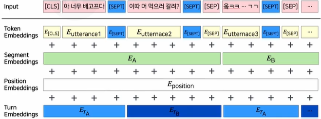
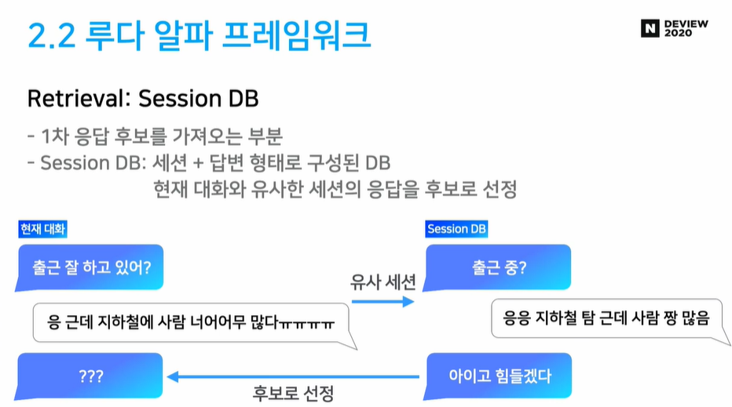
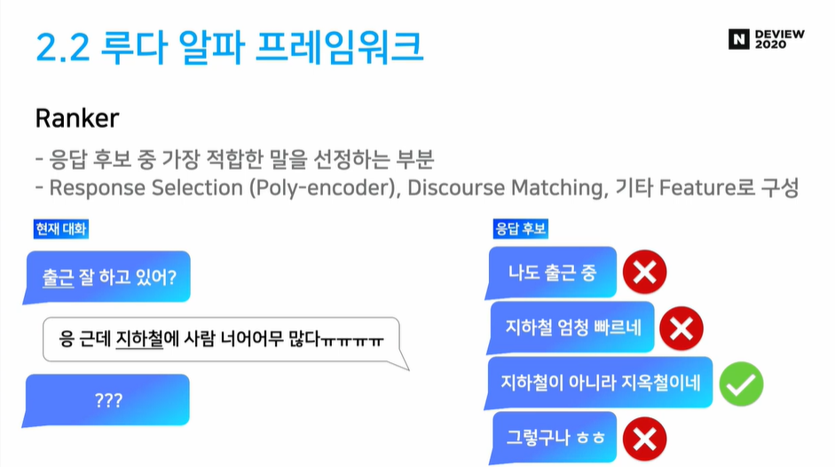
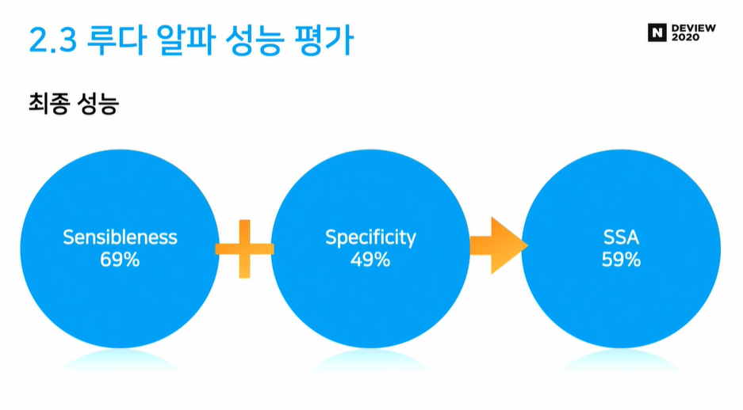
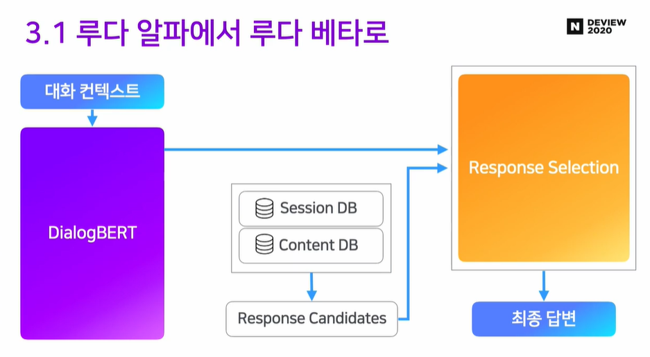
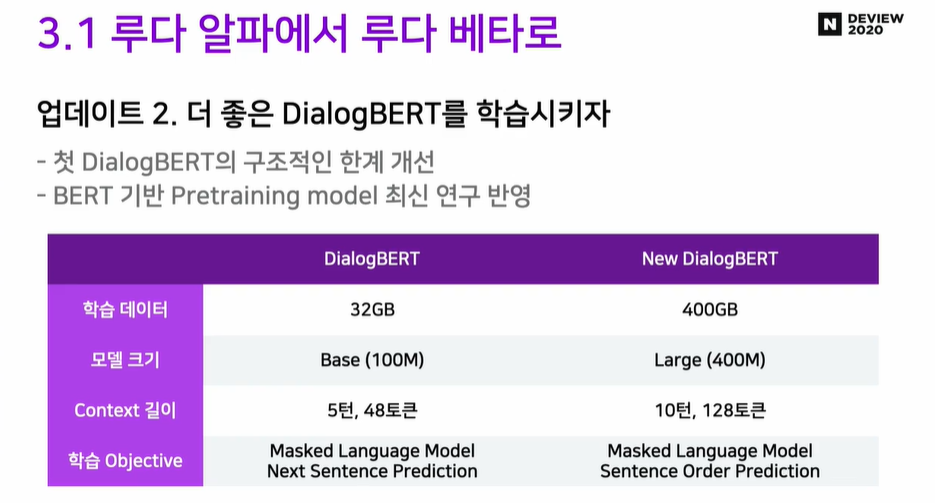
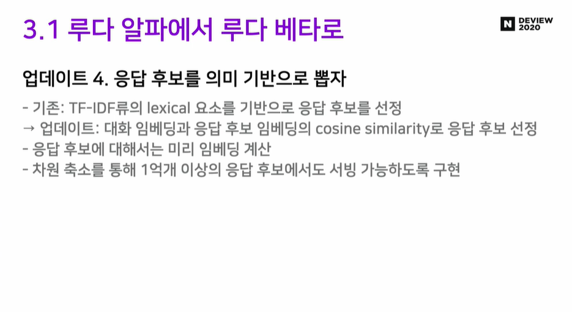
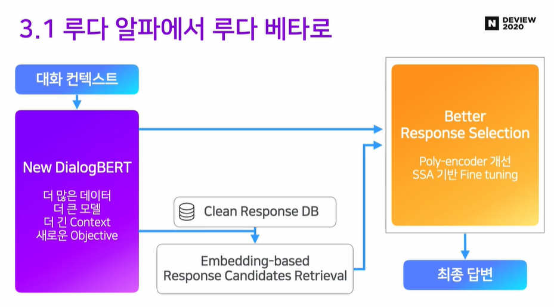

DEVIEW 2020에서 진행한 **"오픈도메인 챗봇 ‘루다’ 육아일기: 탄생부터 클로즈베타까지의 기록"** 발표를 요약 및 정리한 글입니다.

> 전체 발표 영상은 [링크](https://tv.naver.com/v/16968268)에서 확인할 수 있습니다.

## 루다는 어떤 챗봇인가요?

### 오픈 도메인 챗봇 VS 목적 지향형 챗봇

챗봇에는 크게 **오픈 도메인 챗봇**과 **목적 지향형 챗봇** 두 가지 종류가 있습니다. 여기서 **루다는 오픈 도메인 챗봇**입니다.

1. 목적 지향형 챗봇 (Task-oriented Dialogue System)  
   최근 누구나 한번쯤 사용했을법한 **AI 비서**가 대표적인 목적 지향형 챗봇입니다. 날씨 안내, 호텔 예약 등 **사용자의 특정 문제를 해결하기 위한 시스템**입니다. 대표적인 서비스로는 삼성의 Bixby, 구글의 Google Assistant, 애플의 Siri 등이 있으며, 사용자의 의도를 빠르게 파악하고 문제를 정확하게 해결하는 것이 중요합니다.

2. 오픈 도메인 챗봇 (Open Domain Dialogue System)  
   사용자와의 **자유로운 대화를 목적**으로 하는 챗봇입니다. 대표적인 서비스로는 심심이가 있습니다. 적은 대화를 목표로 하는 목적 지향형 챗봇과는 다르게 **사용자와 더욱 오래, 더욱 재밌게 대화를 하는 것**에 초점이 맞추어져 있습니다.

### 오픈 도메인 챗봇이 어려운 이유

1. One-To-Many  
   목적 지향형 챗봇은 하나의 상황에 가장 적절한 하나의 답변이 존재합니다. 하지만 **오픈 도메인 챗봇은 하나의 상황에 서로 다르지만 좋은 답변이 다수 존재할 수 있습니다.**
   또한 이에 다양한 유형의 오답이 존재할 수 있어 이들을 처리하는 것이 까다롭다고 합니다.

2. 무한한 대화 주제와 무한한 문장 유형  
   사용자와 대화할 수 있는 주제는 무한하며 또한 생성될 수 있는 문장 유형 또한 무한합니다. 따라서 **무한에 가까운 컨텍스트가 생성**됩니다. 이들 모든 컨텍스트에 대해 오픈 도메인 챗봇은 **자연스럽고 적절한 답변**을 내놓을 수 있어야 합니다.

3. 부족한 대화 데이터  
   대화형 챗봇을 학습시키려면 **대량의 대화체 데이터**가 필요합니다. 하지만 **대부분의 대형 텍스트 데이터셋들은 문어체로 구성**이 되어 있습니다. 따라서 화자와 턴 등의 특수성이 포함된 대화체 데이터셋을 구하기 어렵습니다. 다행히도 스캐터랩은 한국어 카카오톡 100억건과 일본어 10억 라인 메시지를 보유하고 있어 이들 데이터를 활용하였다고 합니다.

## 루다는 어떻게 만들어졌나요?

루다는 **알파와 베타 두 가지 버전**으로 개발이 진행되었습니다.

### 루다 알파의 프레임워크

루다 알파의 프레임워크는 **Microsoft 사의 오픈 도메인 소셜 챗봇 Xiaoice**에서 기반하였다고 합니다.

Microsoft의 Xiaoice은 중국에서 서비스 중인 소셜 챗봇으로 5억명 이상의 사람들이 사용할 정도로 엄청난 인기를 누리고 있는 서비스입니다. 루다도 Xiaoice처럼 심심할 때 사용자의 말벗이 되어주고 고민을 들어주는 서비스를 목표로 하고 있어 Xiaoice를 기반으로 삼은 듯합니다.

> 보다 자세한 Xiaoice 원리는 [논문](https://arxiv.org/abs/1812.08989)에서 확인할 수 있습니다.

루다 알파의 프레임워크는 크게 **NLU, Retrieval, Ranker 세 파트**로 구성됩니다.

### NLU (Natural Language Understanding) 파트

사용자의 대화 컨텍스트는 제일 먼저 NLU 파트에서 처리하게 됩니다. 위 그림에서 보라색으로 칠해진 부분입니다.
NLU 파트는 DialogBERT와 Emotion, Dialogue Act 등의 모듈로 구성되며 **진행 중인 대화를 루다가 이해**할 수 있도록 하는 역할을 합니다.

NLU 파트에서 주목할 부분은 스캐터랩에서 자체 개발한 **DialogBERT**가 사용되었다는 점입니다.
DialogBERT는 기존 BERT에서 **일상 대화** 학습을 특화시킨 모델로 아래와 같은 것들이 추가되었다고 합니다.

1. 턴 구분 토큰 추가
2. 턴 임베딩 추가
3. 일상 대화 데이터로 학습

> DialogBERT에 대한 자세한 내용은 Deview 2020 [발표 영상](https://tv.naver.com/v/11212753)에서 확인할 수 있습니다.

### Retrieval 파트

NLU 파트에서 대화를 이해했다면, Retrieval 파트에서는 루다의 **대답 후보들을 선정**하는 기능을 담당합니다. 이루다 팀에서 미리 준비한 답변 후보들을 저장해 둔 Session DB와 Content DB로 구성되어 있습니다. 지금까지 진행한 대화와 직전 유저의 메시지를 바탕으로 적절하다고 판단되는 응답 후보 N개를 선정하게 됩니다.

### Ranker 파트

Ranker 파트에서는 앞서 Retrieval 파트에서 선정한 응답 후보들 중 **가장 적절하다고 판단되는 응답을 선정**하게 됩니다. 여기서 Poly-encoder 등의 모델을 사용하였다고 합니다.

## 루다의 성능을 어떻게 평가할 수 있을까요?

오픈 도메인 챗봇의 응답에는 정해진 정답이 있지 않습니다. 앞서 살펴본 One-To-Many 문제처럼 상황에 따라 다양한 정답이 있을 수 있습니다. 이에 학계에서도 아직 오픈 도메인 챗봇에 대한 평가 지표에 대한 의견이 분분하다고 합니다.

루다 알파에서는 **SSA(Sensibleness and Specificity Average)** 라는 지표를 사용하였습니다.
SSA는 구글에서 2020년 초에 발표한 오픈 도메인 챗봇 Meena를 개발할 때 새롭게 제시한 평가 지표입니다.
**Sensibleness와 Specificity 두가지 평가 요소를 바이너리(0 또는 1)로 채점을 진행**하게 됩니다.

루다 알파의 성능을 평가한 결과 **SSA 59%로 준수한 성능**을 기록하였다고 합니다. 참고로 인간의 SSA는 86%이고, 루나가 기반으로 한 Xiaoice의 SSA는 31%라고 합니다.

## 루다 알파를 개선해보자! 루다 베타

루다 알파 테스트를 마무리하며 루다 알파에서 몇가지 문제점들을 발견할 수 있었다고 합니다.

- 복잡한 프레임워크
- 응답 DB의 낮은 퀄리티
- Response Selection 성능
- 나이브한 Retrieval
- 첫 DialogBERT의 구조적 한계

이들 문제점을 해결하기 위해서 루다 베타에서는 크게 5가지의 업데이트를 진행합니다.

1. 프레임워크의 복잡도를 줄이기
2. DialogBERT의 성능 개선
3. 응답 DB 퀄리티 향상
4. 의미 기반 응답 후보 선출
5. Response Selection 성능 개선

### 프레임워크의 복잡도를 줄이자

루다 알파에서 NLU 파트와 Ranker 파트에 Emotion, Topic, Discourse Matching 등 다양한 모듈들이 탑재되어 있었습니다.
이들 모듈로 **향상된 성능에 비해 모델의 복잡도와 컴퓨팅 파워가 너무 많이 들어간다고 판단**하여 과감히 세부 모듈들을 제거하였다고 합니다.

### DialogBERT 성능 개선

**기존 DialogBERT의 학습 데이터 양, 학습 방법 등을 조정하여 모델의 성능을 개선**하였다고 합니다.  
아래 그림을 보면 기존 모델에 비해 학습 데이터의 크기가 약 10배 증가하고 모델 크기도 약 4배 증가하였습니다. 또한 모델 학습에서도 다음 문장을 예측하는 Next Sentence Prediction보다 문장의 올바른 순서를 예측하는 Sentence Order Prediction가 일상 대화 모델에 적합하다고 판단되어 변경하였다고 합니다.

### 응답 DB 퀄리티 향상

기존 Retrieval 파트에서 Session DB와 Content DB로 나누어져 있었습니다. 이를 **단일 DB로 통합**하고 중복 응답, 퀄리티가 낮은 **응답을 필터링**하여 응답 DB 퀄리티를 개선하였습니다.

### 의미 기반 응답 후보 선출

기존에는 응답 후보를 선출할 때 어휘 기반의 TF-IDF류 알고리즘을 사용하였다고 합니다. 하지만 기존 방식은 **대화의 의미를 고려하지 않는다는 문제점**이 있습니다. 이를 해결하기 위해 대화 임베딩과 응답 후보 임베딩의 **코사인 유사도로 대화와 유사한 의미의 응답 후보를 선정**합니다.
더 나아가 **차원 축소**를 통해 1억개 이상의 매우 많은 응답 후보 중에서도 빠르게 선출할 수 있도록 **성능을 개선**하였습니다.

### Response Selection 성능 개선

마지막으로 Ranker 파트의 개선입니다. 앞서 Ranker 파트에서는 선출된 응답 후보들 중 가장 적절한 답변을 선택할 수 있도록 Poly-Encoder 모델이 사용되었습니다.  
이 모델에 직전 턴과 화자의 턴이 담긴 **데이터를 추가로 학습**시키고, **SSA를 기반 데이터를 모델에 파인튜닝** 시키는 등의 작업을 통해 **성능을 개선**할 수 있었다고 합니다.

이렇게 5가지의 업데이트를 마친 **루다 베타의 프레임워크**는 아래와 같습니다.

### 루다 베타의 성능은?

루다 베타의 **최종 성능은 SSA 78%** 로 알파 버전에 비해서 약 **20%의 성능 향상**을 이뤘습니다. 또한 2020년 당시 최고 성능으로 평가받던 **Google Meena에 맞먹는 강력한 성능** 을 보여주고 있습니다.  

## 루다를 개발하며...

루다 팀은 이번 개발에서 아래와 같은 교훈들을 얻었다고 합니다.

- 신뢰할 수 있는 벤치마크를 만들자  
  오픈도메인 특성상 좋은 벤치마크를 만드는 것이 쉽지 않다. 신뢰할 수 있는 벤치마크가 있어야 리서치 방향을 잘 설정할 수 있다.

- Probing Task의 필요성  
  NLP 모델이 어떤 걸 잘하고, 못하는 지 톺아볼 수 있어야 한다.

- 제품을 목표로 하는 머신러닝 리서치의 딜레마  
  리서치의 엄밀함과 제품 릴리스의 속도 사이의 트레이드 오프가 필요하다.
  하지만 대부분의 경우 엄밀한 진행(변인 통제, 실험의 기록, 검증 등)이 오히려 시간을 아끼게 해준다.

- 복잡도 VS 성능  
  최근 연구 중에 프레임워크의 복잡도를 높여 성능을 올리는 경우가 많다. 하지만 때로는 심플함을 위해 성능을 포기하는게 나을 수 있다. 프레임워크가 복잡할수록 오류가 발생할 확률이 높고 빠르게 변화하는 기술을 따라잡기 어렵다

- 머신러닝 제품을 린하게
  Xialoce를 따라 모든 요소를 만들지 않고 작동할 수 있는 최소 제품 (MVP)부터 만들었다면 시간이나 비용을 아낄 수 있었을 것이다. 알파 버전에서 개발했던 Dialogue Act, Topic, Engage Model 등이 결국 지금은 쓰이지 않고 있다.

### 앞으로의 과제

루다의 앞으로의 과제는 아래와 같다고 합니다.

### 중단기 과제

- 페르소나  
  루다가 자기의 페르소나에 맞는 말을 골라내기
- 말을 잘 거는 루다  
  사용자가 답하고 싶은 타이밍에, 답하고 싶은 내용으로 말을 걸 수 있는가?
- Continual Learning  
  사용자와의 대화를 통해 루다를 어떻게 계속 발전시킬 것인가
- 외부 데이터  
  대화 이외의 텍스트를 통해 지식과 컨텐츠를 어떻게 녹여낼 것인가

### 중장기 과제

- 초대형 생성 모델 만들기  
  최근 NLP는 초대형 모델을 기반으로 하고 있음
  2B 파라미터 이상의 생성 모델을 학습할 것인가
- 기억과 개인화  
  어떻게 사용자의 정보와 과거 대화를 기반으로 개인화된 대화를 할 것인가
- 경량화  
  초대형 모델을 어떻게 서빙할 것인가

## 리뷰 후기

지금까지 DEVIEW 2020 "오픈 도메인 챗봇 루다(LUDA)는 어떻게 만들어졌을까?"를 리뷰해보았습니다. 이루다는 출시 당시 많은 관심을 받았던 서비스이고, 필자가 평소에 관심 있던 주제였던만큼 흥미롭고 유익한 내용이 많았습니다. 이번 리뷰를 하며 느끼고, 배운 점을 간단하게 요약해보았습니다.

1. 모델의 속도와 성능, 어느 것을 택해야하는가?

   이번 발표에서 자주 등장했던 주제 중 하나가 **모델의 성능과 속도 사이의 트레이드 오프**입니다. 모델이 정교하고 복잡해질수록 모델의 정확도는 올라가나 이에 소모되는 시간과 컴퓨팅 파워 또한 함께 증가합니다.  
   AI Engineer를 꿈꾸는 학생으로써 성능이 좋은 NLP 모델을 개발하는 것도 중요하지만 **실제 서비스에 원활하게 적용할 수 있는 모델과 파이프라인을 개발할 수 있는 안목**을 길러야겠다고 생각하게 되었습니다.  
   관련하여 추후에 **모델 경량화와 초대형 모델 서빙**와 같은 주제들도 공부해보고 블로그에서 다뤄보도록 하겠습니다.

2. NLP와 인공지능 윤리

   현재 이루다는 개인 정보 유출, 성희롱 등의 문제로 논란을 빚으며 서비스가 중단된 상태입니다. 루다의 강점 중 하나는 독보적인 대량의 카카오톡 대화체 데이터셋을 확보한 것이었습니다. 하지만 오히려 이 점이 서비스의 발목을 잡았습니다.  
   루다 개발 과정에서 PII(Personal Identifiable Information, 개인 식별 정보) 필터링에 미흡한 부분이 있었고 이는 개인 정보 유출로 이어졌습니다. 이전에도 2016년에 마이크로소프트에서 발표한 소셜 챗봇 테이가 인종 차별적이고 폭력적인 메시지를 쏟아내어 서비스 운영이 중단되는 사건이 있었습니다.  
   이들 사건을 보며 NLP 기술이 사람들의 삶에 획기적인 도구가 될 수 있지만 한편으로 **인종 차별과 개인 정보 유출 등의 윤리적 문제를 야기하는 양날의 검**이 될 수 있다는 것을 느꼈습니다. 인공지능과 사람은 하루가 다르게 점점 더 가까워지고 있습니다. 그럴수록 NLP 기술의 발전과 함께 개인 정보나 AI의 편견/혐오에 대응할 수 있는 기술도 함께 발전하여야 합니다.  
   그리고 무엇보다 중요한 것은 **개발자가 인공지능 윤리에 책임감을 가지고 적극적으로 문제를 해결해 나아가야 할 것**입니다. 관련하여 jiho님의 글 [AI 챗봇이랑 윤리랑 무슨 상관인데? <개인정보 편>](https://jiho-ml.com/weekly-nlp-32/)에서 AI 챗봇과 윤리에 대해서 잘 설명하여 한번 읽어보시는 것을 추천합니다.

## Reference

- [https://jiho-ml.com/weekly-nlp-32/](https://jiho-ml.com/weekly-nlp-32/)
- [https://tv.naver.com/v/16968268](https://tv.naver.com/v/16968268)
