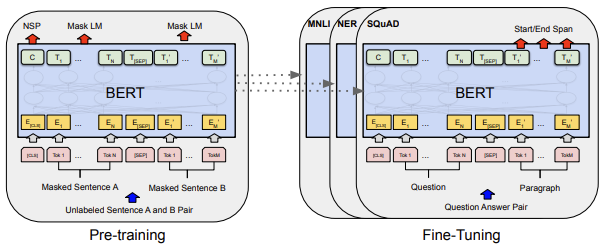

이번 시간에는 Andrew Ng 교수님의 Stanford ML 수업에서 다룬 **효율적인 논문 읽기**를 정리해보았습니다.  
원본 강좌는 아래에서 확인할 수 있습니다.
[Stanford CS230: Deep Learning | Autumn 2018 | Lecture 8 - Career Advice / Reading Research Papers](https://www.youtube.com/watch?v=733m6qBH-jI)  
>> 논문 읽기뿐만 아니라 ML 커리어 발전에 대한 내용도 있습니다! 관심 있으신 분들은 강의 영상을 보시는 것을 추천 드립니다!

## 들어가며...
ML/DL을 공부하다보면 ML/DL 논문 읽기의 중요성을 많이 강조합니다.
하지만 입문자 입장에서 논문을 읽는 것은 쉽지 않습니다. 빽빽하게 영어와 수식으로 채워진 머신러닝/딥러닝 논문을 읽는다는 것이 참 막막합니다. 이를 극복하기 위한 Andrew Ng 교수님의 논문 읽기 Tip을 정리합니다.

## 세상의 논문, 다 읽을 필요 없다.
세상에는 정말 많은 논문이 있습니다. 또한 하루에도 수 백개의 논문이 쏟아져 나옵니다. **이들 논문을 다 읽을 필요가 있을까요? 정답은 X 입니다.**  
본격적으로 논문을 읽어보기 전에, **내가 읽어볼 논문들의 리스트를 만들어봅니다.** 
그리고 여러 논문들을 쭉 훑어보며 **더 읽어볼 논문과 아닌 논문을 취사 선택합니다.**
과정을 정리하면 아래와 같습니다.  

1. 읽을 논문 리스트 만들기
2. 논문 리스트에서 자세히 읽을 논문 선택하기

그러면 얼마나 많은 논문을 읽어야할까요? 교수님은 아래와 같은 가이드라인을 제시합니다.
- **5~20개 읽어봄**: 해당 분야에 기초적인 지식을 갖추고, 어느정도 응용하여 작업할 수 있다.
- **50~100개 읽어봄**: 해당 분야에 깊은 지식을 갖춤.

## 논문 어떻게 읽는가?
그럼 논문을 어떻게 읽는 것이 좋을까요? 
교수님은 **처음부터 끝까지 순서대로 논문을 읽는 것은 바람직하지 않다**라고 합니다.
논문 읽는 법을 자세히 살펴보겠습니다.  

1. **Title/Abstract/Figure 읽어보기**  

우선 첫번째로 할 것은 논문의 Title, Abstract, FIgure을 읽어보는 것입니다. **해당 논문이 무엇을 말하고자 하는지  대략적으로 파악하는 것이 목표입니다.** 특히 ML/DL에서는 Figure 몇 개로 해당 논문의 내용을 요약해둔 경우가 많이 있어 이해하는데 큰 도움이 됩니다.

2. **Introduction/Conclusion/Figures 읽어보기**
Introduction이나 Conclusion은 심사위원들에게 **해당 논문이 왜 Accept 되어야 하는지 설득하는 글**  이라고 볼 수 있습니다. 따라서 논문 저자들은 해당 부분을 아주 신중하게 작성합니다.  
따라서 **Introduction이나 Conclusion만 꼼꼼히 읽더라고 해당 논문이 말하고자 하는 바를 전체적으로 깨달을 수 있습니다.**
또한 이 단계에서 해당 논문을 더 자세히 읽을지 말지를 결정할 수 있습니다.

**이때 Related Work 경우에는 훑어보거나 건너뛰는 것이 좋습니다.** 그 이유는 Related Work의 경우에는 논문 저자가 해당 논문이 얼마나 우수한지 입증하기 위해 다른 연구들을 소개하는 부분이기 때문입니다. 따라서 해당 분야에 익숙하지 않다면 이해하기 어려울 수 있고, 논문을 이해하는데 큰 도움이 되지 않기 때문에 넘어가셔도 무방합니다.

3. **수식은 생략하거나 훑어보기**  

4. **처음부터 끝까지 전체적으로 읽어보기 (단 이해 안 가는 것은 넘어가기)**  
논문을 읽다보면 이해가 도저히 안가는 부분이 있을 수 있습니다. **이해가지 않는 부분은 과감히 생략하도록 합시다.** 우리가 읽을 논문은 굉장히 많습니다. 이해가지 않는 내용을 위해 많은 시간을 소모하는 것을 비효율적일 수 있습니다. 또한 그 내용이 지금은 잘 쓰지 않고 중요하지 않은 내용일 수도 있습니다. 따라서 이해 안가는 부분은 과감히 넘어가도록 합니다.

## 논문을 읽고나서
교수님은 논문을 읽고나서 아래 네 가지 물음에 답해보라고 제시합니다. 이들 질문에 답할 수 있다면 논문을 잘 이해했다는 뜻입니다.
1. **저자가 이루고 싶어한 것은?**
2. **해당 연구에서 중요한 요소(key elements)는?**
3. **이 논문에서 내가 무엇을 사용할 수 있을까?**
4. **Reference 중에서 더 읽어볼만한 것이 있는가?**  

## 논문을 어디서 찾을 수 있을까?

그렇다면 읽을 논문은 어디서 찾을 수 있을까요? 웹 서핑이나 블로그 포스트 등을 통해 얻거나, 주요 State-Of-The-Art 모델들을 찾아보는 방법이 있습니다. 교수님은 추가로 4가지 방법을 제시합니다.
1. **트위터**
최근 많은 연구자들이 Twitter를 사용해 논문이나 학술 정보를 공유합니다. 이들을 통해 최신 논문 정보들을 얻을 수 있습니다. Ex) @kiankata @AndrewYNg
2. **ML Subreddit**
[https://www.reddit.com/r/MachineLearning/](https://www.reddit.com/r/MachineLearning/)에서 다양한 ML 관련 정보들을 얻을 수 있습니다.
3. **주요 ML 학회 (NIPS/ICML/ICLR)**
NIPS/ICML/ICLR와 같은 **주요 머신러닝 학회** 에서 매년 발표되는 중요한 ML 논문들을 얻을 수 있습니다.
4. **친구 혹은 커뮤니티**

## 논문 속 수식을 이해하기
논문 속 수식을 어떻게 잘 이해할 수 있을까요?
- **처음부터 다시 유도해보자**  
시간이 오래 걸릴 수 있지만 가장 확실한 방법입니다. 빈 종이에 해당 수식을 직접 처음부터 다시 유도해보는 것입니다. 이를 통해 수식을 깊게 이해하고 실력을 크게 향상시킬 수 있습니다.  

## 논문 속 코드를 이해하기
마찬가지로 논문 속 코드는 어떻게 이해할 수 있을까요? 
1. 오픈소스 활용하기
최근에는 [paperswithcode](https://paperswithcode.com/)처럼 논문 속 코드가 오픈 소스로 많이 공개되어 있습니다. 이들 오픈 소스를 실행시켜보며 이해하는 방법이 있습니다.
2. 밑바닥부터 코드를 구현해보기
수식과 마찬가지로 논문을 밑바닥부터 코드로 구현해보는 것입니다. 처음부터 하나하나 논문을 코드로 구현하다보면 논문을 보다 깊게 이해할 수 있습니다.

## 꾸준하게.
**Steady Reading, not shorts burst.**
**무엇보다 실력 향상을 위해 중요한 것은 꾸준함입니다.** 방학동안 50~100개의 논문을 몰아서 읽으려하지 말고, 주당 1~2개의 논문을 꾸준히 읽도록 해봅시다. 그럼 어느새 실력이 크게 향상한 자신을 발견할 수 있을겁니다.

