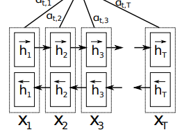
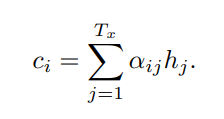
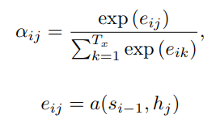
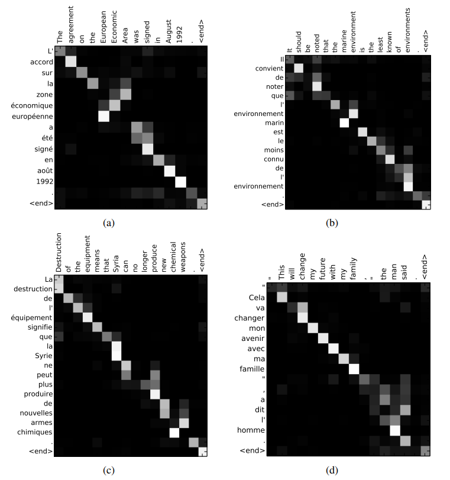
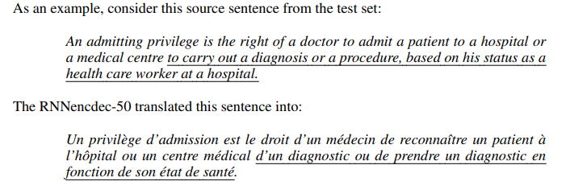

이번 시간에는 [Neural Machine Translation By Jointly Learning To Align And Translate](https://arxiv.org/abs/1409.0473) 논문을 리뷰합니다.  
기존 Seq2Seq 모델은 Encoder에서 **입력 문장을 하나의 context vector에 정보를 압축**해서 번역을 진행했습니다. 하지만 이는 Decoder에 정보를 넘겨줄 때 **정보의 손실**이 일어나 긴 문장에 대해서는 번역을 잘 수행하지 못하는 한계가 있었습니다. 이 문제를 해결하기 위해서 본 논문은 **Seq2Seq 모델에 Attention 기법을 적용한 모델을 제시**합니다. Seq2Seq 모델이 궁금하신 분은 [Learning Phrase Representation using RNN Encoder-Decoder for Statistical Machine Translation 논문 리뷰](https://facerain.club/seq2seq-paper/)도 함께 보시면 도움이 됩니다.

## Abstract & Introduction

- 기존 RNN Encoder-Decoder 모델에서 **입력 문장의 길이가 길어질수록 성능이 급격히 떨어지는 문제** 발생
- 연구팀은 해당 모델에서 **Fixed-length Vector의 사용**이 성능 향상의 **bottleneck** 라고 추측
- 연구팀은 위 문제를 해결하기 위해 target word의 예측과 관련 깊은 source sentence의 일부를 자동으로 search하는 **Attention 기법**을 제안 (논문에서 Attention 기법이라는 이름을 사용하지는 않습니다 🙂)
- RNN 모델에 해당 Attention 기법을 적용하니, **긴 입력 문장을 더욱 잘 처리**하고, SOTA 성능의 **pharse-based 시스템과 대등한 성능**을 보임

   모델")

## Learning To Align And Translate

아래 그림은 연구팀이 제안한 Attention을 적용한 Encoder-Decoder 모델입니다.

Encoder와 Decoder로 나누어 차례대로 살펴보겠습니다.

## Encoder

연구팀은 **Encoder**에 **Bi-Directional RNN 모델을 사용**하였습니다.

**Bi-Directional RNN**은 Forward RNN과 Backward RNN으로 구성됩니다.

Forward RNN은 입력 문장을 순서대로 읽어, **forward hidden state** ($\overset{→}{h_1}$...$\overset{→}{h_t}$)를 계산하고, Backward RNN은 역순으로 입력받아 **backward hidden state**($\overset{←}{h_1}$...$\overset{←}{h_t}$)를 계산합니다.

biRNN 모델은 각 단어의 hidden state를 계산할 때 **앞의 단어 뿐만 아니라 뒤의 단어들도 고려할 수 있다는 장점**이 있습니다.

그리고 Forward hidden state ($\overset{→}{h_1}$...$\overset{→}{h_t}$)와 Backward hidden state($\overset{←}{h_1}$...$\overset{←}{h_t}$)를 합쳐(concat) time-step j의 hidden state $h_j$를 구할 수 있습니다.

위와 같이 구한 $h_j$는 $x_j$와 앞 뒤로 인접한 **이전 단어들과 다음 단어들의 정보를 가지고 있습니다.** 이것은 다음에 알아볼 decoder에서 alignment model과 context vector를 계산할 때 사용하게 됩니다.

> RNN은 비교적 주변 state의 정보를 많이 가지고 있는 경향이 있습니다. 예를 들어 어떤 RNN에서 $h_j$는 $h_{j-1}$이나 $h_{j-2}$ 등 인접한 state의 정보를 보다 많이 가지고 있습니다. 따라서 forward hidden state와 backward hidden state의 값을 합친 $h_j$는 x_j 앞 뒤로 인접한 단어들의 정보를 담고 있게 되는 것입니다.

## Decoder

기존 Seq2Seq 모델에서는 Decoder의 Hidden State를 계산할 때 하나의 Context Vector ($c$)만을 사용했습니다.  
**하지만 연구팀이 제안한 모델에서는 Hidden State $s_i$를 계산할 때 각각의 target word 에 따라 개별적인 Context Vector $c_i$를 사용합니다.**

각각의 Context Vector $c_i$를 구하는 방법을 알아봅시다.

$c_i$는 앞서 **Encoder에서 구한 Annotaion $h_j$를 가중합하여** 계산합니다.

Annotation $h_j$의 각각의 weight인 $\alpha_{ij}$는 아래와 같이 구할 수 있습니다.

weight $\alpha_{ij}$는 score $e_{ij}$에 softmax를 취한 값으로 0~1 사이의 값을 가지게 됩니다.

$\alpha_{ij}$가 높을 수록 **해당 target word와 source word가 연관성이 높다는 것을 의미** 합니다.

score $e_{ij}$는 Decoder에서 i번째의 output 정보와, Encoder에서 j 주변의 Input들의 정보가 얼마나 잘 맞는지 나타내는 점수입니다.

해당 점수는 Decoder의 **Hidden State $s_{i-1}$과 입력 문장의 Annotation $h_j$을 feedforward neural network를 거쳐** 구할 수 있습니다.

이때 신경망 a를 alignment model이라 하며, 제안된 시스템의 다른 모든 요소들과 함께 공동으로 학습됩니다.

## Experiment

연구팀은 WMT 14 **영어-프랑스어 병렬 말뭉치** 를 사용하여 실험을 진행했습니다.

실험에 사용한 4가지 모델은 아래와 같습니다.

- RNNencdec-30 : 30단어까지의 문장으로 학습된 RNN Encoder-Decoder
- RNNencdec-50: 50단어까지의 문장으로 학습된 RNN Encoder-Decoder
- RNNsearch-30 : 30단어까지의 문장으로 학습된 RNN Encoder-Decoder With Attention 기법
- RNNsearch-50 : 50단어까지의 문장으로 학습된 RNN Encoder-Decoder With Attention 기법

RNNencdec는 각각 1000개의 hidden unit들을 가지고, RNNsearch의 경우 forward와 backward RNN 각각에 1000개의 hidden unit을 가지고 있습니다.

모델을 학습시킬때는 Adadelta 기법을 적용한 미니 배치 SGD를 사용하였습니다. 이때 미니 배치의 크기는 80 문장입니다. 연구팀은 각 모델을 학습시키는데 대략 5일정도 걸렸다고 합니다.
학습한 모델은 테스트 데이터셋을 이용하여 정성 및 정량 평가를 진행하였습니다.

## Result

실험 결과를 살펴봅시다.

### Quantitative Results

연구팀은 4가지 모델의 **BLEU 점수를** 측정하여 정량 평가를 실시하였습니다.

BLEU가 높을수록 높은 성능을 의미하는데, 연구팀이 제안한 RNNsearch가 RNNencdec보다 BLEU 점수가 높았습니다. **특히 RNNsearch-50의 경우 기존 pharse-based SMT 방식인 Moses에 근접한 성능을 내고 있습니다.**

특히 기존 RNNencdec의 경우 문장이 길어질수록 번역 성능이 급격히 낮아졌습니다. **하지만 RNNsearch는 문장이 길어지더라도 번역 성능을 유지하는 것을 확인할 수 있습니다.**

### Qualitative Analysis

정성 평가를 살펴보겠습니다. 아래 그림의 각 픽셀은 j-번째 입력 단어(영어)와 i 번째 출력 단어(프랑스어)의 Weight $\alpha_{ij}$ 값을 나타냅니다. **픽셀의 색상이 흰색일수록 두 단어간의 연관성이 높음을 의미합니다.**

(a)에서 [European Economic Area]를 [zone economique europeen]에 주목하면, **두 구의 어순이 다름에도, 단어들을 정확하게 매칭하여 번역을 진행하였습니다.**

또한 (d)에서 [the man]을 [l’ homme]로 번역한 것을 주목해봅시다. 사실 영어 [the]는 프랑스어로 [le], [la], [les], [l’] 다양하게 번역될 수 있습니다. 기존 hard-alignment 방식은 한 입력 단어는 다른 한 번역 단어로 일대일 매핑되어야만 했습니다. 따라서 위 문장을 번역하는데 어려움을 겪었습니다. 하지만 해당 모델은 soft-alignment하게 번역하므로, 해당 문제를 자연스럽게 해결할 수 있었습니다.

기존 RNNencdec은 문장이 길어질수록 고정된 크기의 context vector에 담을 수 있는 정보에 한계가 있었습니다. 따라서 번역이 진행될수록 번역 결과가 이상해지는 경향이 많았습니다. 아래 문장에서 밑줄 친 부분이 바로 입력 문장의 의미와 다르게 번역이 된 곳입니다.

**하지만 제안한 RNNsearch는 입력 문장이 길어져도 전체 의미를 보존하며 빠뜨리는 내용 없이 번역을 진행할 수 있습니다.**

## Conclusion

- 기존 Seq2Seq 방식은 긴 입력 문장을 처리하는데 한계가 있음
- 연구팀은 Context Vector에 모든 정보를 압축할 필요 없는 Attention 기법을 적용한 Model을 제안
- Attention 기법은 다음 target word를 생성할 때 관련있는 source sentence의 부분에 집중할 수 있도록 함. (soft-alignment)
- **Attention을 통해 긴 입력 문장에 대해서도 번역을 잘 수행할 수 있음**
- 신경망이 번역기의 서브 모듈이 아닌 **그 자체로서 번역기의 임무를 수행해냄 (End-to-End 신경망 기계 번역기의 시작)**
- 모르는, 희귀한 단어들을 어떻게 처리할 것인지 추가 연구 필요
